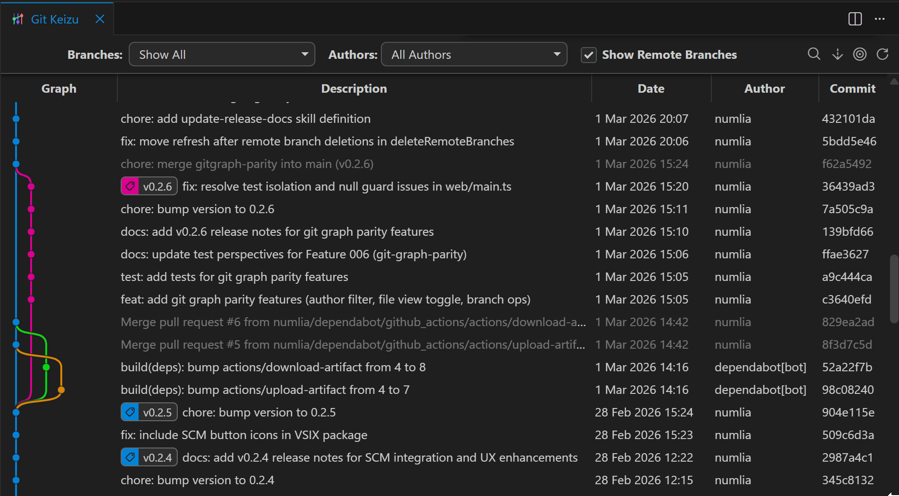
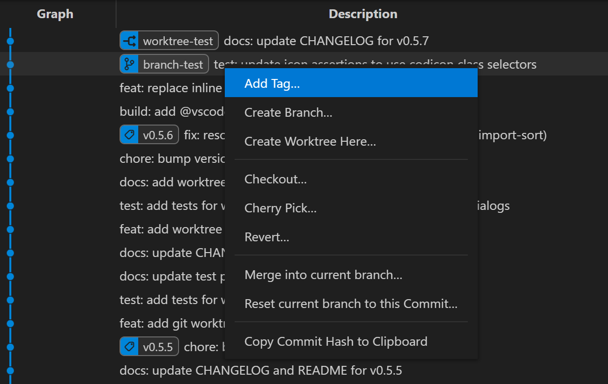
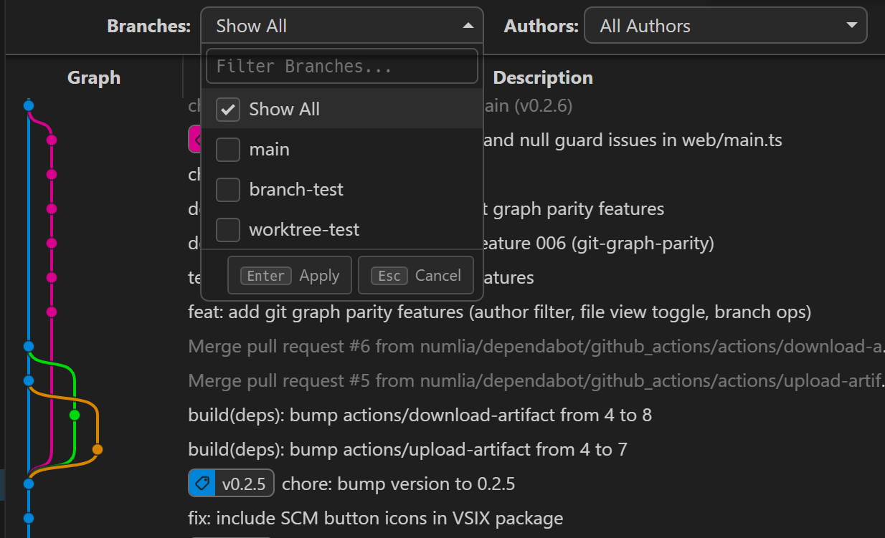
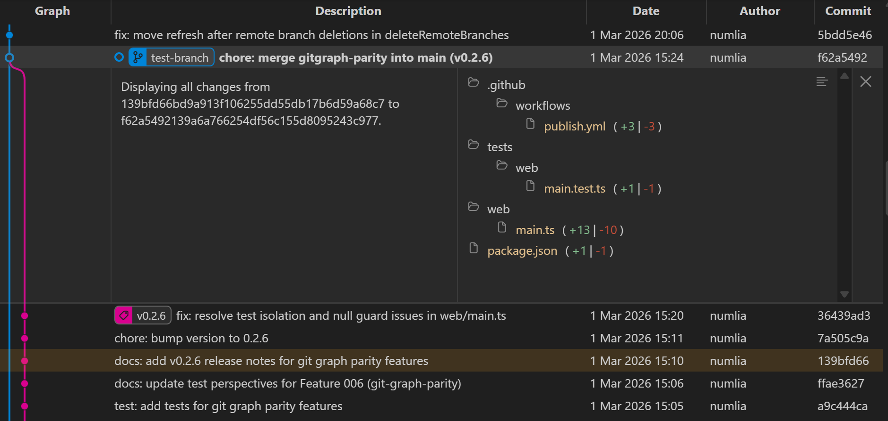

  
  <samp>
    <h1>Git Keizu for Visual Studio Code</h1>
    <h3>View your Git history as a graph, and do common Git actions directly from it</h3>
  </samp>

**Git Keizu** is a fast, focused **git history graph** for Visual Studio Code. View all your branches, commits, stashes, and tags in one interactive visual graph — and perform git actions (checkout, merge, rebase, cherry-pick, stash) directly from it, without ever opening a terminal.

An actively maintained fork of [Git Graph](https://github.com/mhutchie/vscode-git-graph) (MIT, 2019), intentionally kept focused on the essentials. If the core graph experience is what you're after, this is for you.

## Screenshots

**Graph view** — all branches, tags, stashes, and uncommitted changes in one visual graph. Merge commits are dimmed by default to keep the important commits easy to spot:

**Commit actions** — right-click any commit to checkout, cherry-pick, revert, merge, reset, or add a tag, without ever opening a terminal:

**Branch filter** — narrow the graph to one or more branches with a multi-select dropdown:

**2-commit comparison** — Ctrl/Cmd+click a second commit to see all changes between the two:

## Features

- **Graph View**: See all your branches, tags, stash entries, and uncommitted changes in one visual graph. The menu bar and column headers stay fixed as you scroll, so controls are always within reach in long histories.
- **Commit display order**: Choose how commits are sorted in the graph — Date (default, by committer date), Topological (same-branch commits appear consecutively), or Author Date. Set the global default in settings (`git-keizu.repository.commits.order`); override per repository via the table header right-click context menu. The current order is indicated with a checkmark.
- **Muted merge commits**: Merge commits are shown with dimmed text (commit message, date, author, and hash) by default, making non-merge commits easier to spot in a busy history. Branch labels always render at full opacity regardless of mute state. Non-ancestor commits can also be muted via settings (`git-keizu.repository.commits.mute.*`).
- **Author Filter**: A multi-select dropdown in the toolbar lets you filter commits by author — select one or more names to show only their commits, or choose "Show All" to clear the filter. The author list covers all authors reachable from HEAD (not just the currently loaded commits), so no one is missed even in long histories.
- **Commit Details**: Click on a commit to see what changed and view diffs for any file. The panel height adjusts to your viewport size, and the view only scrolls enough to bring the panel into view — no jarring auto-center on every click. Parent hashes are clickable links that jump straight to the parent commit's details.
- **File View Toggle**: Switch between Tree View (folder hierarchy) and List View (flat alphabetical list of full paths) in the commit details panel; the chosen mode is saved per repository.
- **Branch filter**: A multi-select dropdown in the toolbar lets you filter the graph to one or more branches simultaneously; selecting no individual branch returns to "Show All" (all branches visible).
- **Branch Actions**: Right-click to create, checkout, delete, rename, merge, or rebase branches. The Create Branch dialog includes a "Check out" checkbox (on by default) to automatically switch to the new branch after creation. The Merge dialog exposes "Squash Commits" and "No Commit" options in addition to the existing "No Fast Forward" checkbox. When deleting a local branch, an optional checkbox lets you also delete the corresponding remote branch in one step.
- **Remote Branch Actions**: Right-click a remote branch label to delete it on the remote, merge it into the current branch, or check it out as a new local branch.
- **Tag Actions**: Add, delete, and push tags directly from the graph
- **Commit Actions**: Checkout, cherry-pick, revert, or reset to any commit. The Cherry-pick dialog now includes "Record Origin" and "No Commit" checkboxes; merge-commit cherry-picks also show a parent selector
- **Stash Support**: Stash entries appear in the graph with a distinct visual style; right-click to apply, pop, drop, or create a branch from a stash
- **Uncommitted Changes Actions**: Right-click the Uncommitted Changes row to stash, reset (Mixed/Hard), or clean untracked files
- **Configurable dialog defaults**: Set the initial checkbox state for Merge ("No Fast Forward", "Squash Commits", "No Commit"), Cherry-pick ("Record Origin", "No Commit"), and Stash ("Include Untracked") dialogs via `git-keizu.dialog.*` settings — your preferred options are pre-selected each time a dialog opens
- **Pull/Push for current branch**: Right-click the currently checked-out branch to run `git pull` or `git push` directly from the graph
- **Fetch with automatic prune**: The Fetch button runs `git fetch --prune` — stale remote-tracking references are cleaned up automatically on every fetch
- **SCM Panel Button**: Open the Git Keizu graph directly from the VS Code Source Control panel title bar; the repository is selected automatically based on the active SCM provider. Button position (Inline or More Actions menu) is configurable
- **Keyboard Shortcuts**: Configurable shortcuts for Find (Ctrl/Cmd+F), Refresh (Ctrl/Cmd+R), Scroll to HEAD (Ctrl/Cmd+H), and Scroll to Stash (Ctrl/Cmd+S, Shift to go backward); each can be rebound or disabled in settings
- **Arrow key commit navigation**: With a commit's detail panel open, navigate between commits using Arrow keys — no modifier for table order, Ctrl/Cmd for branch-tracking (parent/child on the same branch), and Ctrl/Cmd+Shift to cross to an alternative branch or merge source; disabled in comparison mode
- **Commit Search**: Press Ctrl/Cmd+F to open a search bar with regex mode, case-sensitive mode, match counter (N of M), and prev/next navigation
- **2-Commit Comparison**: Ctrl/Cmd+click a second commit to compare it with the selected commit; the panel header shows "Displaying all changes from [older] to [newer]" in chronological order, and comparison state is preserved when switching VS Code tabs
- **Combined branch/remote labels**: Local and remote branches on the same commit merge into a single pill label — `[main | origin]`. Right-clicking either part opens the appropriate context menu.
- **Scroll position restore**: When you switch away from the Git Keizu tab and return, the graph scrolls back to where you left off. The position is saved whenever a user action (clicking a commit, toggling a filter, etc.) triggers a state save; passively scrolling without any action does not trigger a save.
- **Smooth refresh**: Git operations update the graph in the background without blanking the view or losing your scroll position
- **Auto load more commits**: Commits load automatically as you scroll to the bottom of the list — no manual button press needed (configurable)
- **Dropdown overflow handling**: Long branch and repository names are truncated with an ellipsis; hover to see the full name in a tooltip
- **Avatar Support**: Optionally fetch commit author avatars from GitHub, GitLab, or Gravatar
- **Multi-Repository**: Support for multiple Git repositories in one workspace
- **Configurable**: Customize graph colors, style, date format, and more

## Extension Commands

| Command                               | Description                            |
| ------------------------------------- | -------------------------------------- |
| `Git Keizu: View Git Keizu (git log)` | Open the Git Keizu graph view          |
| `Git Keizu: Clear Avatar Cache`       | Clear all cached commit author avatars |

## Extension Settings

All settings are under the `git-keizu.*` namespace.

### General

| Setting                                 | Default        | Description                                                  |
| --------------------------------------- | -------------- | ------------------------------------------------------------ |
| `dateFormat`                            | `Date & Time`  | Date format: `Date & Time`, `Date Only`, or `Relative`       |
| `dateType`                              | `Author Date`  | Date type: `Author Date` or `Commit Date`                    |
| `fetchAvatars`                          | `false`        | Fetch commit author avatars from GitHub, GitLab, or Gravatar |
| `graphColours`                          | _(12 colours)_ | Colours used on the graph (HEX or RGB array)                 |
| `graphStyle`                            | `rounded`      | Graph line style: `rounded` or `angular`                     |
| `initialLoadCommits`                    | `300`          | Number of commits to initially load                          |
| `loadMoreCommits`                       | `100`          | Number of additional commits to load at a time               |
| `loadMoreCommitsAutomatically`          | `true`         | Automatically load more commits when scrolling to the bottom |
| `maxDepthOfRepoSearch`                  | `0`            | Maximum depth of subfolders to search for repositories       |
| `showCurrentBranchByDefault`            | `false`        | Show only the current branch when the graph is opened        |
| `showStatusBarItem`                     | `true`         | Show a Status Bar item to open Git Keizu                     |
| `showUncommittedChanges`                | `true`         | Show uncommitted changes row in the graph                    |
| `tabIconColourTheme`                    | `colour`       | Tab icon theme: `colour` or `grey`                           |
| `sourceCodeProviderIntegrationLocation` | `Inline`       | SCM title bar button position: `Inline` or `More Actions`    |

### Keyboard Shortcuts (`keyboardShortcut*`)

| Setting            | Default        | Description                                                     |
| ------------------ | -------------- | --------------------------------------------------------------- |
| `...Find`          | `CTRL/CMD + F` | Keyboard shortcut for Find (`UNASSIGNED` to disable)            |
| `...Refresh`       | `CTRL/CMD + R` | Keyboard shortcut for Refresh (`UNASSIGNED` to disable)         |
| `...ScrollToHead`  | `CTRL/CMD + H` | Keyboard shortcut for Scroll to HEAD (`UNASSIGNED` to disable)  |
| `...ScrollToStash` | `CTRL/CMD + S` | Keyboard shortcut for Scroll to Stash (`UNASSIGNED` to disable) |

### Dialog Defaults (`dialog.*`)

| Setting                                           | Default | Description                                                                     |
| ------------------------------------------------- | ------- | ------------------------------------------------------------------------------- |
| `dialog.merge.noFastForward`                      | `true`  | Default state of "Create a new commit even if fast-forward is possible" (Merge) |
| `dialog.merge.squashCommits`                      | `false` | Default state of "Squash Commits" checkbox (Merge)                              |
| `dialog.merge.noCommit`                           | `false` | Default state of "No Commit" checkbox (Merge)                                   |
| `dialog.cherryPick.recordOrigin`                  | `false` | Default state of "Record Origin" checkbox (Cherry-pick)                         |
| `dialog.cherryPick.noCommit`                      | `false` | Default state of "No Commit" checkbox (Cherry-pick)                             |
| `dialog.stashUncommittedChanges.includeUntracked` | `false` | Default state of "Include Untracked" checkbox (Stash Uncommitted Changes)       |

### Commit Ordering (`repository.commits.order`)

| Setting                    | Default | Description                                                                                                 |
| -------------------------- | ------- | ----------------------------------------------------------------------------------------------------------- |
| `repository.commits.order` | `date`  | Commit sort order: `date` (committer date), `topo` (topological, same-branch consecutive), or `author-date` |

Per-repository override is available via the table header right-click context menu.

### Commit Muting (`repository.commits.mute.*`)

| Setting                               | Default | Description                                               |
| ------------------------------------- | ------- | --------------------------------------------------------- |
| `...mergeCommits`                     | `true`  | Display merge commits with reduced opacity                |
| `...commitsThatAreNotAncestorsOfHead` | `false` | Display non-ancestor-of-HEAD commits with reduced opacity |

## Security

Git Keizu has undergone a full security audit and remediation (27 issues fixed):

- **Shell injection eliminated** — all git commands use `child_process.spawn()` exclusively; `exec()` has been removed entirely
- **Git binary validation** — the configured `git.path` is validated to be an absolute path pointing to a `git` executable, preventing arbitrary command execution via a malicious `.vscode/settings.json`
- **Commit hash validation** — every operation that accepts a commit hash validates the format before passing it to git
- **Repository path validation** — all messages from the webview are checked against the registered repository list, preventing commands from running against arbitrary directories
- **Path traversal prevention** — file path arguments are checked for `..` sequences
- **SSRF protection** — avatar fetch requests are restricted to an allowlist of known domains (GitHub, GitLab, Gravatar)
- **XSS fixes** — commit parent hashes, avatar data URIs, and other dynamic values are properly HTML-escaped before insertion into the webview

## Installation

Search for **git-keizu** in Extensions, or install from:

- [VS Code Marketplace](https://marketplace.visualstudio.com/items?itemName=numlia-vs.git-keizu)
- [Open VSX Registry](https://open-vsx.org/extension/numlia-vs/git-keizu)

## Contributing & Support

The codebase has been modernized from its 2019 origins: async/await throughout, ES2020 targets, a Vitest test suite, and oxlint/oxfmt for consistent style.

Bug reports and feedback via [GitHub Issues](https://github.com/numlia/git-keizu/issues) are welcome. This is a personal project maintained in spare time — responses and fixes are not guaranteed, but reports are appreciated.

## Acknowledgements

A big thank you to the original author, [mhutchie](https://github.com/mhutchie), for creating this amazing extension.

Thanks also to [asispts](https://github.com/asispts) for carrying the project forward — stripping it down to the essentials and keeping it focused on what matters most.

## License

MIT — see [LICENSE](LICENSE).

> Not affiliated with or endorsed by the original Git Graph or neo-git-graph projects.
