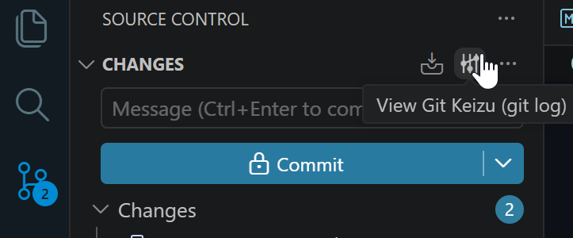
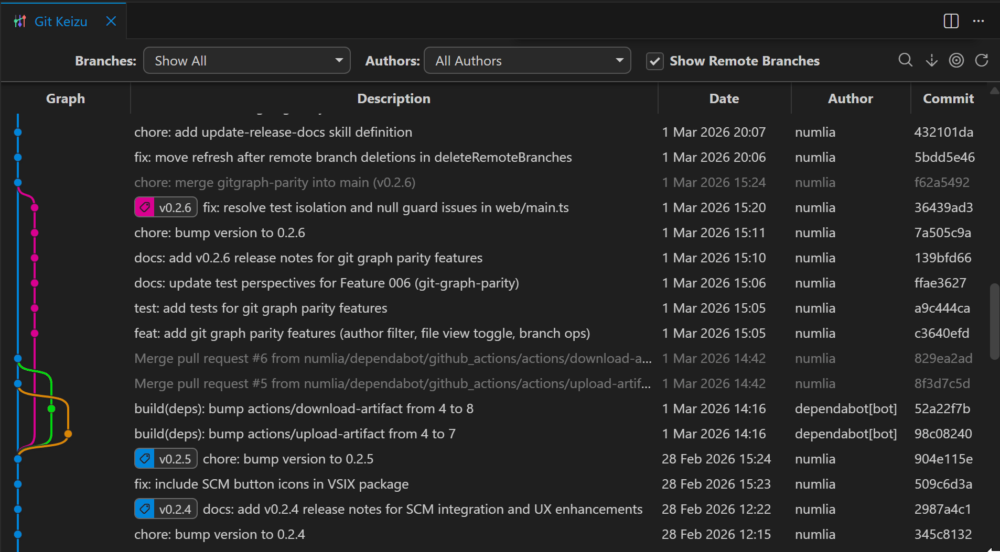
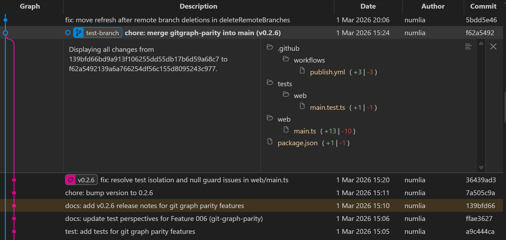
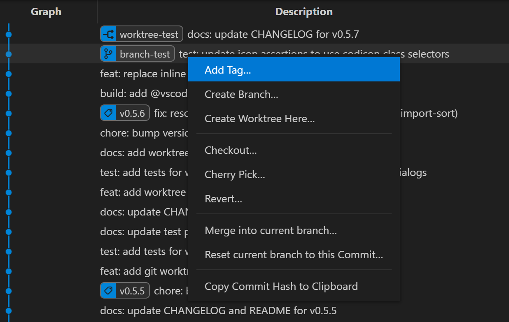
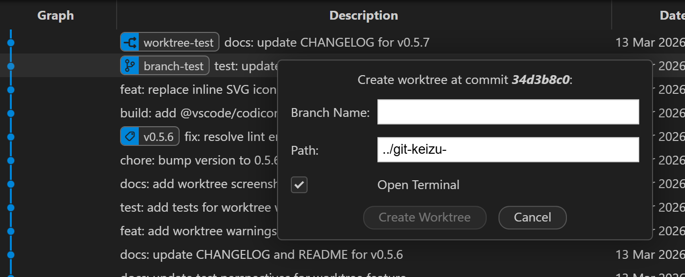

  
  <samp>
    <h1>Git Keizu</h1>
    <h3>View your Git history as a graph, and do common Git actions directly from it</h3>
  </samp>

**Git Keizu** is a focused Git history graph for VS Code. Explore branches, commits, stashes, tags, and uncommitted changes in one graph. Run common Git actions and manage worktrees without opening a terminal.

Git Keizu is an actively maintained fork of [Git Graph](https://github.com/mhutchie/vscode-git-graph), intentionally focused on the core graph experience.

> **Japanese UI supported / 日本語UI対応**
>
> Set VS Code's display language to Japanese and the entire Git Keizu interface — commands, settings, menus, dialogs, error messages, and dates — switches to Japanese automatically. No extra configuration required.
>
> VS Codeの表示言語を日本語に設定するだけで、コマンド、設定項目、メニュー、ダイアログ、エラーメッセージ、日付表示まで含めて、Git Keizuのインターフェース全体が自動的に日本語へ切り替わります。追加の設定は不要です。

## Getting Started

Open a folder or workspace that contains a Git repository. On first use, the Git Keizu Status Bar item may not be visible yet. Open the graph using either of these methods:

1. **Source Control**: Open VS Code's built-in Source Control view and click the Git Keizu graph button in the view title.
2. **Command Palette**: Run `Git Keizu: View Git Keizu (git log)`.

After Git Keizu has been activated and detects a repository, the Status Bar item appears by default and provides a quick way to reopen the graph.

## Highlights

### Understand your repository at a glance

See branches, commits, tags, stash entries, and uncommitted changes together in one graph.

- Filter the graph by branch or author, and search commit messages with regex and case-sensitive modes.
- Choose date, topological, or author-date ordering. Merge commits and non-ancestor commits can be visually muted.
- Combined local and remote labels, automatic commit loading, and restored scroll position keep long histories manageable.

### Inspect changes and compare commits

Select a commit to inspect its files and diffs, or Ctrl/Cmd+click a second commit to compare the two.

- Switch commit files between a folder tree and a flat list.
- Open working-tree files directly from commit details; renamed files are resolved through Git rename tracking.
- Navigate commits with the keyboard, follow parent links, and keep comparison state when switching tabs.

### Run Git actions from the graph

Right-click commits, branches, tags, stash entries, or uncommitted changes to access the actions available for that item.

- Checkout, cherry-pick, merge, rebase, create branches, manage tags, and apply or pop stashes.
- Pull and push the current branch, including choosing an upstream when one has not been configured. Fetch automatically prunes stale remote-tracking references.
- Common actions appear first, while less-used and destructive actions are grouped under **More…**. Confirmation dialogs expose relevant Git options before execution.
- **Branch Cleanup** collects every local branch into one panel with the facts needed to decide whether it can be deleted — ancestry against a comparison branch, ahead/behind counts, tree differences, upstream state, worktree usage, and last commit date — then lets you show a branch in the graph or open its delete dialog. It gives no safe-or-unsafe verdict and deletes nothing on its own.
- When a branch deletion is rejected because Git could not confirm the branch is fully merged, the error dialog explains why — including after squash merges and rebases — and what to check before using Force Delete, with the original Git output preserved in a collapsible section.

### Manage worktrees visually

Create and manage Git worktrees without leaving the graph.

- Create a worktree from a branch or any commit, with a suggested path derived from the branch name.
- Open a worktree in VS Code or a terminal, reveal it in the file manager, copy its path, or remove it.
- Linked and detached-HEAD worktrees remain visible in the graph, including detached commits outside the loaded history.

### Designed for everyday use

- Recent context-menu actions are remembered per repository, making repeated workflows quicker.
- Git operations refresh the graph in the background without blanking the view or discarding its state.
- Multiple repositories, configurable keyboard shortcuts, optional avatars, graph colours, date formats, and dialog defaults are supported.

## Requirements

- **Git 2.32 or later** is required. Viewing the changes contained in a stash entry uses `git stash show -u`, whose `-u` (`--include-untracked`) option was added in Git 2.32. Older Git versions are not supported.

## Reference

### Commands

| Command                               | Description                            |
| ------------------------------------- | -------------------------------------- |
| `Git Keizu: View Git Keizu (git log)` | Open the Git Keizu graph view          |
| `Git Keizu: Clear Avatar Cache`       | Clear all cached commit author avatars |

### Settings

All settings are under the `git-keizu.*` namespace.

#### General

| Setting                                 | Default        | Description                                                                           |
| --------------------------------------- | -------------- | ------------------------------------------------------------------------------------- |
| `dateFormat`                            | `Date & Time`  | Date format: `Date & Time`, `Date Only`, or `Relative`                                |
| `dateType`                              | `Author Date`  | Date type: `Author Date` or `Commit Date`                                             |
| `fetchAvatars`                          | `false`        | Fetch commit author avatars from GitHub, GitLab, or Gravatar                          |
| `graphColours`                          | _(12 colours)_ | Colours used on the graph (HEX, RGB, or RGBA array)                                   |
| `graphStyle`                            | `rounded`      | Graph line style: `rounded` or `angular`                                              |
| `initialLoadCommits`                    | `300`          | Number of commits to initially load                                                   |
| `loadMoreCommits`                       | `100`          | Number of additional commits to load at a time                                        |
| `loadMoreCommitsAutomatically`          | `true`         | Automatically load more commits when scrolling to the bottom                          |
| `openNewTabEditorGroup`                 | `Active`       | Editor group for "Open File" in commit details: `Active`, `Beside`, `One`–`Nine`      |
| `maxDepthOfRepoSearch`                  | `0`            | Maximum depth of subfolders to search for repositories                                |
| `showCurrentBranchByDefault`            | `false`        | Show only the current branch when the graph is opened                                 |
| `showStatusBarItem`                     | `true`         | Show a Status Bar item to open Git Keizu                                              |
| `menu.showRecentActions`                | `true`         | Show a "Recent" section at the top of context menus when recent actions are available |
| `showUncommittedChanges`                | `true`         | Show uncommitted changes row in the graph                                             |
| `tabIconColourTheme`                    | `colour`       | Tab icon theme: `colour` or `grey`                                                    |
| `sourceCodeProviderIntegrationLocation` | `Inline`       | SCM title bar button position: `Inline` or `More Actions`                             |

#### Keyboard Shortcuts (`keyboardShortcut*`)

| Setting            | Default        | Description                                                     |
| ------------------ | -------------- | --------------------------------------------------------------- |
| `...Find`          | `CTRL/CMD + F` | Keyboard shortcut for Find (`UNASSIGNED` to disable)            |
| `...Refresh`       | `CTRL/CMD + R` | Keyboard shortcut for Refresh (`UNASSIGNED` to disable)         |
| `...ScrollToHead`  | `CTRL/CMD + H` | Keyboard shortcut for Scroll to HEAD (`UNASSIGNED` to disable)  |
| `...ScrollToStash` | `CTRL/CMD + S` | Keyboard shortcut for Scroll to Stash (`UNASSIGNED` to disable) |

#### Dialog Defaults (`dialog.*`)

| Setting                                           | Default | Description                                                                     |
| ------------------------------------------------- | ------- | ------------------------------------------------------------------------------- |
| `dialog.merge.noFastForward`                      | `true`  | Default state of "Create a new commit even if fast-forward is possible" (Merge) |
| `dialog.merge.squashCommits`                      | `false` | Default state of "Squash Commits" checkbox (Merge)                              |
| `dialog.merge.noCommit`                           | `false` | Default state of "No Commit" checkbox (Merge)                                   |
| `dialog.cherryPick.recordOrigin`                  | `false` | Default state of "Record Origin" checkbox (Cherry-pick)                         |
| `dialog.cherryPick.noCommit`                      | `false` | Default state of "No Commit" checkbox (Cherry-pick)                             |
| `dialog.stashUncommittedChanges.includeUntracked` | `false` | Default state of "Include Untracked" checkbox (Stash Uncommitted Changes)       |
| `dialog.createWorktree.openTerminal`              | `true`  | Default state of "Open Terminal" checkbox (Create Worktree)                     |
| `dialog.removeWorktree.deleteBranch`              | `true`  | Default state of "Also delete branch" checkbox (Remove Worktree)                |

#### Commit Ordering (`repository.commits.order`)

| Setting                    | Default | Description                                                                                                 |
| -------------------------- | ------- | ----------------------------------------------------------------------------------------------------------- |
| `repository.commits.order` | `date`  | Commit sort order: `date` (committer date), `topo` (topological, same-branch consecutive), or `author-date` |

Per-repository override is available via the table header right-click context menu.

#### Commit Muting (`repository.commits.mute.*`)

| Setting                               | Default | Description                                               |
| ------------------------------------- | ------- | --------------------------------------------------------- |
| `...mergeCommits`                     | `true`  | Display merge commits with reduced opacity                |
| `...commitsThatAreNotAncestorsOfHead` | `false` | Display non-ancestor-of-HEAD commits with reduced opacity |

## Security

Git Keizu applies the following safeguards around Git execution, repository access, avatar requests, and webview content:

- **Shell injection eliminated** — all git commands use `child_process.spawn()` exclusively; `exec()` has been removed entirely
- **Git binary resolution** — the configured `git.path` (a single path or, as VS Code allows, a list of candidate paths) is verified by running each candidate with `--version` and only the first working executable is adopted; unusable values fall back to `git` on the PATH
- **Commit hash validation** — every operation that accepts a commit hash validates the format before passing it to git
- **Repository path validation** — all messages from the webview are checked against the registered repository list, preventing commands from running against arbitrary directories
- **Path traversal prevention** — file path arguments are checked for `..` sequences
- **SSRF protection** — avatar fetch requests are restricted to an allowlist of known domains (GitHub, GitLab, Gravatar)
- **XSS fixes** — commit parent hashes, avatar data URIs, and other dynamic values are properly HTML-escaped before insertion into the webview

## Support and Contributing

### Support

Bug reports and feedback via [GitHub Issues](https://github.com/numlia/git-keizu/issues) are welcome. This is a personal project maintained in spare time — responses and fixes are not guaranteed, but reports are appreciated.

### Contributing

The codebase uses async/await throughout, targets ES2020, and includes a Vitest test suite with oxlint and oxfmt for consistent style.

Pull requests are welcome as well. Fork the repository and open a pull request against `main`. CI runs `pnpm run format`, `pnpm run lint`, `pnpm run typecheck`, and `pnpm run test:ci`, so please confirm those pass locally first. For anything larger than a small fix, opening an issue first helps avoid wasted effort.

Supported build environments are **Linux, macOS, and WSL**. The build scripts rely on Unix shell commands (such as `rm` and `cp`), so building on a native Windows shell is not supported — on Windows, please develop inside WSL.

## Acknowledgements

A big thank you to the original author, [mhutchie](https://github.com/mhutchie), for creating this amazing extension.

Thanks also to [asispts](https://github.com/asispts) for carrying the project forward — stripping it down to the essentials and keeping it focused on what matters most.

## License

MIT — see [LICENSE](LICENSE).

> Not affiliated with or endorsed by the original Git Graph or neo-git-graph projects.
